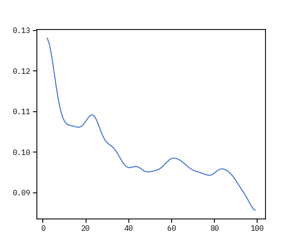

```{r setup_py}
# Python path needs to be established before doing anything else. (Not cleary why— something about an R session not being able to have more than one Python instance.)
library(reticulate)
conda_list()

use_python(
  python = "C:/Users/mehedia/AppData/Local/Continuum/miniconda3/envs/ds37/python.exe", 
  required = TRUE)

# check if correct env
py_config()

```


```{r setup, include=FALSE}
library(tufte)
library(DT)

knitr::opts_chunk$set(
  # warning = FALSE,
  # error = FALSE,
  # message = FALSE,
  echo = FALSE,
  fig.width =6,
  fig.height = 5
)

source(here::here('helpers/setup.R'))
source(here::here("helpers/drawMaps.R"))
```

How wide runs the gamut of socio-economic differences between US cities? In what ways are larger cities different from smaller ones (ignoring ignoring population size)? Or, how big is the contrast between Silicon Valley and the cities in the rest of the country? Questions like these can be answered if we can quantify "socioeconomic differences" between cities.

In the analysis that follows, I'll attempt to do so, with the eventual goal of clustering the cities based on similarity.

## Why Clustering?

# The Data

The data from the most recent (2013–17) version of _American Community Survey_ (ACS), a program of the Census Bureau to collect the most comprehensive socioeconomic data about US residents.^^[Census Bureau releases, every year, two sets of data, one based on the previous year's responses, collected from a sample of 1% of US population, and the other based on the accumulation of previous five years' responses. The five-year version provides greater confidence in the data, with it having been estimated from a larger sample (5% of US population)] The selected data comprises 382 observations, each a metropolitan statistical area^quantify differences between and across US metropolitan statistical areas (MSAs),^["[a] core area containing a substantial population nucleus, together with adjacent communities having a high degree of economic and social integration with that core." See [here](https://www.census.gov/programs-surveys/metro-micro/about.html) for more.], and about 180 variables, ^[See the full list of variables in this [Excel file](https://www.dropbox.com/s/1d35pt8jymp770n/ACS5YR2017_ProfileVariables_Selected.xlsx?dl=0).] covering a range of attributes of each MSA's residents.The broad categories are:

- Income, inequality, poverty
- Educational attainment
- Employment status, types of occupation
- Housing characteristics
- Immigration (both from other parts of the country and from abroad)
- Race/ethnicity, age, marital status

`r tufte::margin_note("Anyone looking at the complete list would note that I've not been particularly selective. That is because *Principal Component Analysis* (PCA), soon to be performed on the data, will take care of the redundant and non-discriminant variables, doing so in a much more methodical way than human judgement can do at this stage.")`

<!-- `r tufte::margin_note("If you'd rather skip the commentary and go straight to the clusters, here they are (Excel file).")` -->

## Minimizing Variability


<!-- The final clustering would depend on my initial selection of data. -->

<!-- The inclusion or exclusion of one or more variables  -->

```{r process_data, include=FALSE}
all_profile_variables = readxl::read_excel(here::here("data_/processed/ACS5YR2017_ProfileVariables_Selected.xlsx"), trim_ws = TRUE)

selected_variables <-  all_profile_variables %>%
  filter(selected == 1) %>%
  select(variable)

df <- get_acs(
  geography = msa,
  variables = as.vector(selected_variables$variable),
  survey = "acs5"
)
# Clean up: remove micropolitans and PRs
df_metros <- df %>%
  filter(stringr::str_detect(NAME, "Metro Area")) %>%
  filter(!(stringr::str_detect(NAME, ", PR "))) %>%
  mutate(NAME = stringr::str_replace(
    string = NAME,
    pattern = " Metro Area",
    replacement = ""
  ))

# Convert to wide format before clustering
df_metros_wide <- df_metros %>%
  select(-moe) %>%
  spread(variable, estimate)

# write to be able to process with python
write_csv(df_metros_wide,
          here::here("data_/output/Metros_SelectedData_Unscaled.csv"))

df_metros_scaled <- df_metros_wide %>%
  select(-GEOID, -NAME) %>%
  scale() %>% 
  as_tibble() %>% 
  mutate_all(~round(., 3))

# write to be able to process with python
write_csv(as.data.frame(df_metros_scaled),
          here::here("data_/output/Metros_SelectedData_Scaled.csv"))
```


```{python py_libraries}
import numpy as np, pandas as pd
import matplotlib.pyplot as plt
import seaborn as sns

from sklearn.cluster import MiniBatchKMeans, KMeans
from sklearn.preprocessing import StandardScaler
from sklearn.decomposition import PCA
from sklearn.metrics import pairwise_distances
from sklearn.metrics import silhouette_score, silhouette_samples

sns.set_context("notebook")

# from matplotlib import style
# style.available
# plt.style.use("ggplot")
# plt.style.use("seaborn")
# plt.style.use("Solarize_Light2")
plt.style.use("seaborn-muted")
plt.rcParams["font.family"] = "IBM Plex Mono"
```

```{python py_read_data}

# Traverses path from the current Rmd file
df_metros_scaled = pd.read_csv("../../../data_/output/Metros_SelectedData_Scaled.csv")
df_metros_unscaled = pd.read_csv("../../../data_/output/Metros_SelectedData_Unscaled.csv")
```

# Finding Optimum Parameters

## Principal Component Analysis (PCA): How Many Components?

```{python py_pca_fit}
pca = PCA()
pca.fit(df_metros_scaled)
```


```{python, fig.width = 8, fig.height = 6}
# Plot number of components vs variance explained
fig, ax = plt.subplots()
ax.plot(np.cumsum(pca.explained_variance_ratio_), lw=3)
ax.set_xlabel("Number of components")
ax.set_ylabel("Explained variance (cumulative)")
ax.set_xticks(ticks=range(0, 180, 20))
plt.show()
fig.savefig("figures/pca_components_variance.png")
```


```{python py_pca_transform, include=FALSE}
# We decide to have x components that explain about y% of the variance, as seen in the plot.
pca = PCA(0.95)
df_pca = pca.fit_transform(df_metros_scaled)
```


# The Model

## How Many Clusters?

```{python sil_scores, eval=TRUE}
kmeans_sil_scores = {}

for k in range(2, 100):
    model = KMeans(n_clusters=k)
    cluster_labels = model.fit_predict(df_pca)
    kmeans_sil_scores[k] = silhouette_score(df_pca, cluster_labels)

x_ = list(kmeans_sil_scores.keys())
y_ = list(kmeans_sil_scores.values())

from scipy.ndimage.filters import gaussian_filter1d
ysmoothed = gaussian_filter1d(y_, sigma=3)

fig, ax = plt.subplots()
ax.plot(x_, ysmoothed )
fig.savefig("figures/kmeans_sil_scores_smoothed.png")
```


```{python elbow_method, eval=TRUE, echo=FALSE}
kmeans_inertias = {}

for k in range(2, 100):
    model = KMeans(n_clusters=k)
    model.fit(df_pca)
    kmeans_inertias[k] = model.inertia_

fig, ax = plt.subplots()    
ax.plot(kmeans_inertias.keys(), kmeans_inertias.values())
fig.savefig("figures/elbow_method.png")
```


I'll leave the details of how this algorithm works. Suffice it say

```{python clustering_model}
num_clusters = 15
model = KMeans(n_clusters=num_clusters, n_init=100, max_iter=1000)
cluster_labels = model.fit_predict(df_pca)
```

# The Clusters


```{python dict_clusters}

metro_codes_names = df_metros_unscaled.iloc[:,0:2]
metro_codes = df_metros_unscaled.iloc[:,0:1]
metro_names = df_metros_unscaled.iloc[:,1:2]

dict_clusters = {}
dict_clusters_codes = {}
dict_clusters_names = {}

# Make cluster names start from 1 instead of zero; hence str(i + 1)
for i in range(num_clusters):
  dict_clusters["cluster_" + str(i+1)]= metro_codes_names.loc[np.where(cluster_labels == i)]
  dict_clusters_codes["cluster_" + str(i+1)]= metro_codes.loc[np.where(cluster_labels == i)]
  dict_clusters_names["cluster_" + str(i+1)]= np.array(metro_names.loc[np.where(cluster_labels == i)])

```

```{r}
clusters = py$dict_clusters_names

clusters_lengths <- lengths(clusters)

x_ = names(clusters_lengths)
y_ = unname(clusters_lengths)


g <- ggplot()+
  geom_col(mapping = aes(x = reorder(x_, y_), y = y_)) +
  geom_label(aes(x = reorder(x_, y_), y = y_, label = y_)) +
  xlab("Clusters ordered by the number of cities they contain") +
  ylab("Number of cities in each cluster") +
  coord_flip() +
  theme(panel.grid.major.x = element_blank(),
        panel.grid.major.y = element_blank())

ggsave("figures/clusterlengths.svg", plot = g)
```


# How Good Was the Clustering?

There are ways to measure how well the algorithm was able to divide the cities into distinct clusters.  
<!-- The challenge -->
```{python}
# Look at only the first two components: shows the challenge of separating the dots into clusters
plt.scatter(df_pca[:, 0], df_pca[:, 1], alpha=0.4, color="red")
# plt.show()
```


```{python metros_mostdistinct, eval=TRUE}
metros_least_ambiguous = np.where(silhouette_samples(df_pca, cluster_labels) > 0.3)
df_metros_unscaled.loc[list(metros_least_ambiguous[0]), 'NAME']
```

A silhoutte score of `python silhouette_score(df_pca, cluster_labels)`

```{python silhouette_cluster_quality, eval=TRUE}
def silhouette_cluster_quality(thresh_list):
    for el in thresh_list:
        metro_index = np.where(silhouette_samples(df_pca, cluster_labels) > el)
        print(el, len(metro_index[0]))
silhouette_cluster_quality([-0.1, 0, 0.1, 0.2, 0.3, 0.4, 0.5])
```


```{python eval=TRUE}
fig, ax = plt.subplots()

ax.scatter(cluster_labels, silhouette_samples(df_pca, cluster_labels), 
  s=50, c="darkblue", alpha=0.4)

ax.axhline(color="green", linewidth=1)
# ax.set_xticks(np.linspace(0, num_clusters))
 
fig.savefig("figures/silhouette_samples.png")
```

 


# ```{r}
# library(tidyverse)
# library(gapminder)
# library(highcharter)
# data(gapminder, package = "gapminder")
# 
# gp <- gapminder %>%
#   arrange(desc(year)) %>%
#   distinct(country, .keep_all = TRUE)
# 
# gp2 <- gapminder %>%
#   select(country, year, pop) %>% 
#   nest(-country) %>%
#   mutate(
#     data = map(data, mutate_mapping, hcaes(x = year, y = pop), drop = TRUE),
#     data = map(data, list_parse)
#     ) %>%
#   rename(ttdata = data)
# 
# gptot <- left_join(gp, gp2, by = "country")
# 
# hchart(
#   gptot,
#   "point",
#   hcaes(lifeExp, gdpPercap, name = country, size = pop, group = continent)) %>%
#   hc_yAxis(type = "logarithmic") %>% 
#   # here is the magic (inside the function)
#   hc_tooltip(useHTML = TRUE, pointFormatter = tooltip_chart(accesor = "ttdata")) %>% 
#   hc_add_theme(hc_theme_flat())  
# ```
